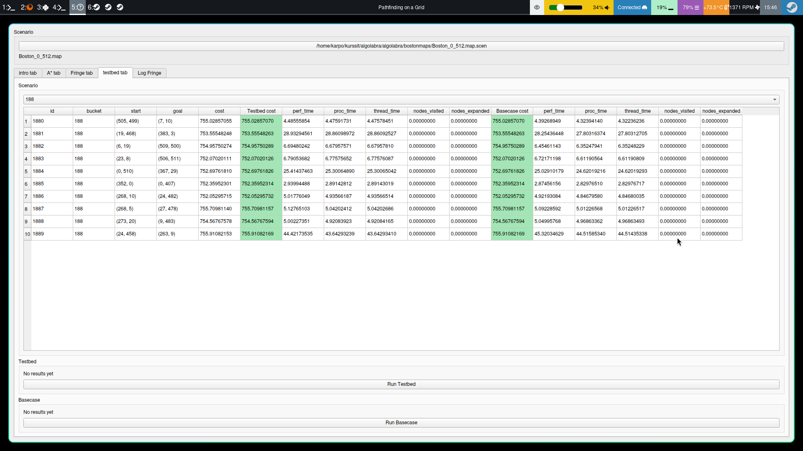

## Some test runs

above: 0 series test runs, fast version with deque vs dequef

above: 10 series test runs, fast version with deque vs dequef

above: 100 series test runs, fast version with deque vs dequef

above: 100 series test runs, same, rotate neighbor if current.x < goal.x

above: 100 series test runs, same, rotate neighbor if current.x > goal.x
ics/0-series)
above: 188 series test runs, fast version with deque vs dequef